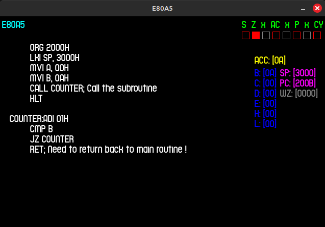

# E80A5
- Emulator for Intel 8085
- Two pass assembler
- GUI using my wrapper SDL2 class that I use for graphic callbacks. 
  [ Check this out: https://github.com/Lunatico97/TopDownScrollerUsingCPP ]

